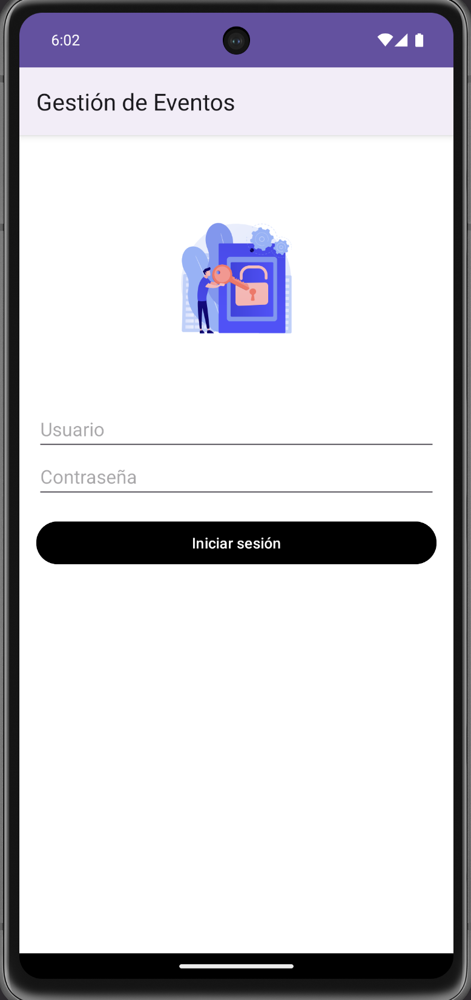
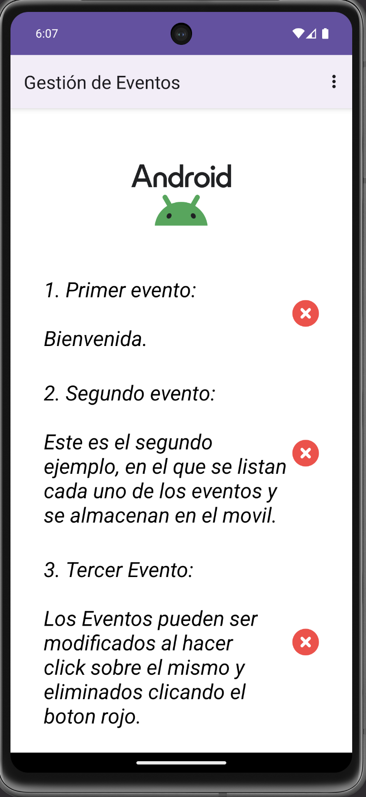

# Gestor de Eventos

Proyecto de Prueba: App para manejar eventos.

Para logearse:

Usuario: ruiz

Contraseña: ruiz

Permite crear, modificar y eliminar eventos, que se guardan en base de datos local en el móvil.

## Imágenes

## Requerimientos:

 - Desarrollo de una APP: Gestor de Eventos ⭐
 - Contener al menos tres actividades: Login ⭐ Main ⭐ Item ⭐
 - Pasar parametros en almenos dos actividades, recuperarlo y usarlo en una segunda actividad: Edit Item ⭐ Item Layout ⭐
 - Mostrar al menos un diálogo en respuesta a una accion del usuario: Al crear, Modificar, eliminar eventos ⭐
 - Implementar sistema de sesión mediante SharedPreferences: Login ⭐
 - Base de datos SQlite para almacenar y gestionar datos relevantes de la aplicación: Eventos ⭐
 - Uitlizar RecyclerView para mostar una lista y capturar un evento de click en cada elemento: Eventos ⭐ Editar ⭐ Eliminar ⭐

## Tech Stack

**Utilizando:** Android Studio, Kotlin.

## License

[MIT](https://choosealicense.com/licenses/mit/)
